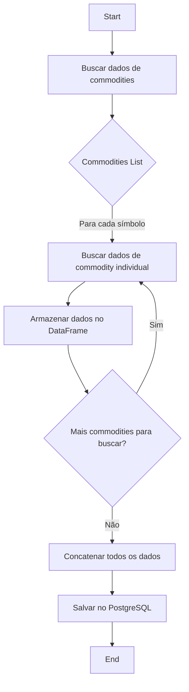

# Data Warehouse

```mermaid
graph TD;
    A[Start] --> B[Buscar dados de commodities]
    B --> C{Commodities List}
    C -->|Para cada símbolo| D[Buscar dados de commodity individual]
    D --> E[Armazenar dados no DataFrame]
    E --> F{Mais commodities para buscar?}
    F --> |Sim| D
    F --> |Não| G[Concatenar todos os dados]
    G --> H[Salvar no PostgreSQL]
    H --> I[End]
```